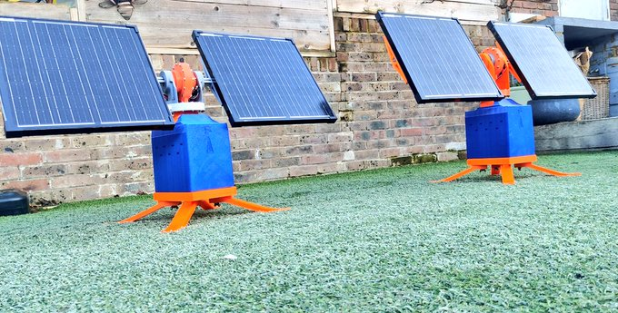
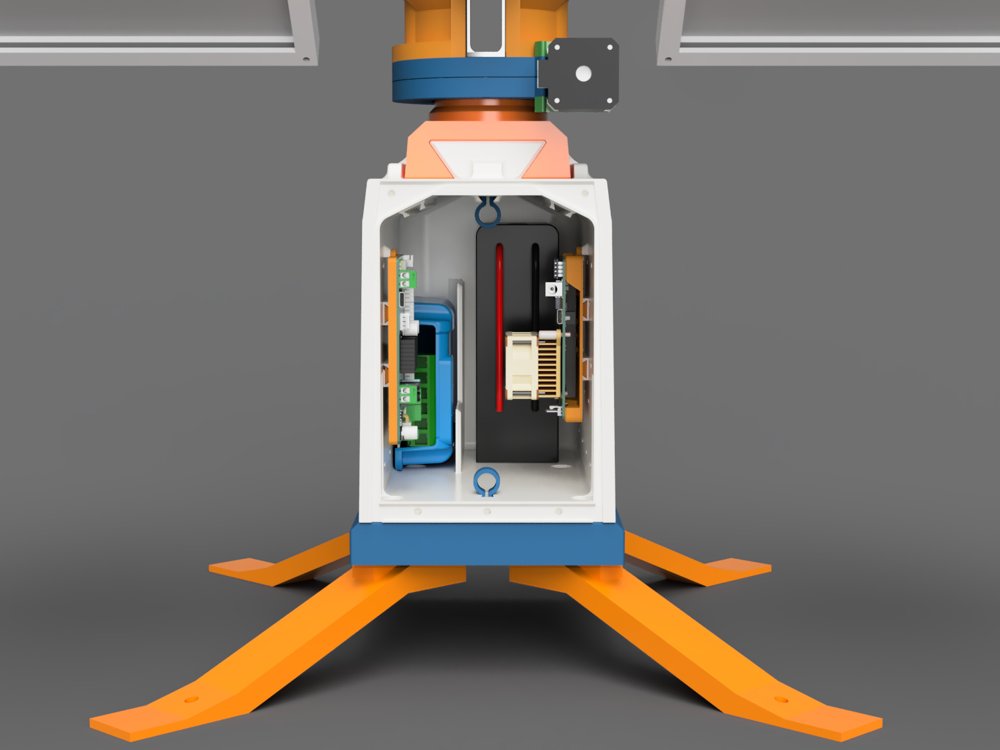
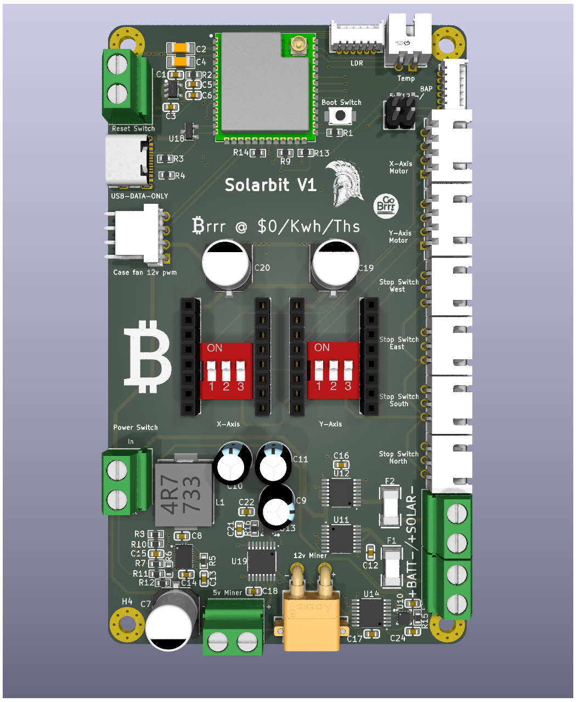

# **Solar₿it**

## **The Dawn of Perpetual Solar Powered ₿ Home Mining**

### What's in this Repo

- [x] Prototype build folder

- [x] Firmware Alpha

#

### Meet the Solar₿it
### $0 / Kwh / Ths

Your <a href="https://osmu.wiki/" target="_blank">OSMU</a> perpetual energy partner.

## Summary of Specs:

- [x]Off-grid (wifi coverage required)

- [x]Outdoor (uv & water resistant)

- [x]Day time ops only

- [x]Fully autonomous power management

- [x]Fully autonomous 2 axis Sun tracking

- [x]30w / 60w Solar PV model dependant.

- [x]Esp32 S3 with external antenna

- [x]4 xINA260AIPWR power monitoring ICs for extensive power monitoring.

- [x]Case temp monitoring for active thermal management

- [x]Compatible with all Bitaxe series of $BTC miner (5v barrel jack and 12v XT-30)

- [x]Bitaxe accessory port (BAP) ready

Note: As this is a live project, all data is subject to change at any time.

<iframe src="https://www.youtube.com/embed/_ywQv0ST36M" 
        title="Solarbit Pre production walk around" frameborder="0" allowfullscreen
        allow="accelerometer; autoplay; clipboard-write; encrypted-media; gyroscope; picture-in-picture" 
        style="position: absolute; width: 100%; height: 100%;">
</iframe>

If you wish to support our work you can visit us on
<a href="https://geyser.fund/project/solarbit?hero=holdings" target="_blank">Geyser</a>

